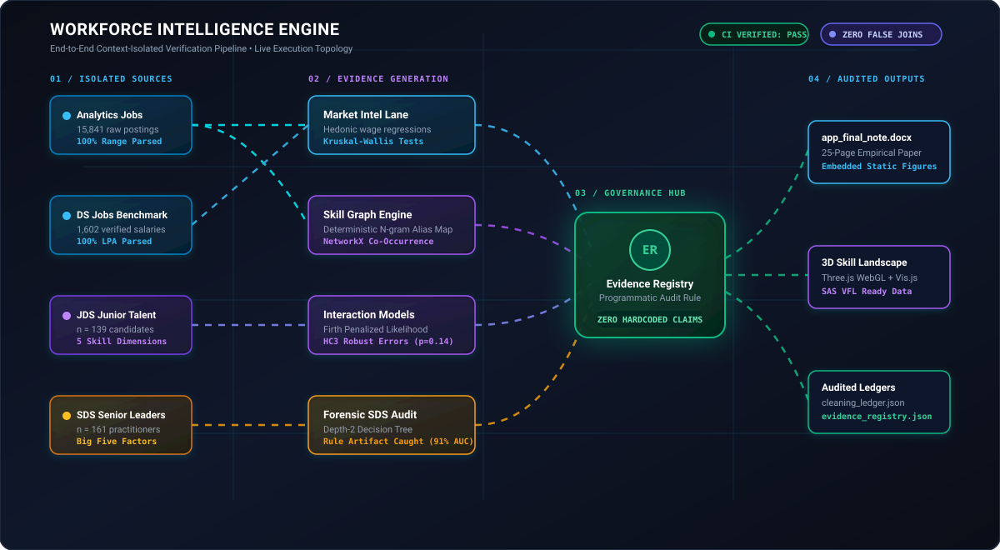
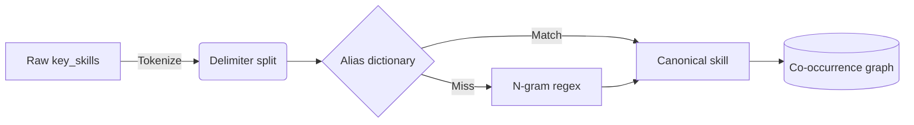

# Workforce Intelligence Engine

**SAS CU Hackathon 2026 — Team ctrl shift n**

[](https://github.com/17prabhanshu/ctrl-shift-n-winpeat/actions/workflows/ci.yml)
[](https://www.python.org/)
[](https://www.sas.com/en_us/software/viya.html)
[](LICENSE)

<div align="center" style="margin: 14px 0;">
  <a href="https://htmlpreview.github.io/?https://github.com/17prabhanshu/ctrl-shift-n-winpeat/blob/main/docs/interactive_3d_landscape.html">
    
  </a>
  &nbsp;
  <a href="https://htmlpreview.github.io/?https://github.com/17prabhanshu/ctrl-shift-n-winpeat/blob/main/docs/interactive_graph.html">
    
  </a>
</div>

> Where the market pays a premium for technical skill, does it pay more when that skill is paired with communication skill — and do junior and senior files show the same pattern?

---

## Results at a Glance

| Dataset | Best Model | ROC-AUC | Accuracy | F1 | n |
|---------|-----------|---------|----------|-----|---|
| JDS (Junior Skills) | Logistic Regression | 0.904 | 0.865 | 0.875 | 139 |
| SDS (Senior Personality) | ExtraTrees | 0.998 | 0.972 | 0.975 | 161 |

**SDS caveat:** A depth-2 decision tree achieves 0.917 AUC using two thresholds (`openness > 38.5`, `conscientiousness > 36.5`), suggesting the labels are derived from personality scores rather than observed real-world outcomes. We treat the high AUC as a data-generation artifact, not a product feature. See [forensic analysis](src/benchmarking/sds_forensic.py).

**Shuffled-target sanity:** When targets are randomly permuted, SDS AUC drops to ~0.589 (consistent with chance), indicating the pipeline does not leak label information into features.

---

## Pipeline Architecture & Live Execution Topology

Four datasets, no shared primary key. Merging rows on weak keys (e.g. job title) induces the Ecological Fallacy. We process each dataset in an isolated evidence lane and compare statistical conclusions, never raw rows.

<p align="center">
  
</p>

---

## Hypotheses

| ID | Statement | Data | Result |
|----|-----------|------|--------|
| H1 | Role families differ in demand and salary | DS Jobs | Supported (Kruskal-Wallis) |
| H2 | Skill requirements show role-specificity | Analytics Jobs | Supported |
| H3 | Technical and communication skills show positive complementarity in salary | Analytics Jobs | Positive coefficient (+0.087), p=0.148 |
| H4 | Dashboard and quantitative skills interact in JDS promotion | JDS | Supported (Logistic Regression) |
| H5 | Conscientiousness has non-additive effects in SDS | SDS | Labels likely deterministic (forensic finding) |

---

## Data Engineering

Salaries arrived as text (`"7.8L"`, `"6to10"`); experience as `"6-10 yrs"`. We wrote format-profiling parsers that return `(value, format_code)`, so the cleaning ledger records exact parse rates per format — not hardcoded example counts.

Skills from the `key_skills` column are tokenized and mapped to five canonical dimensions via a deterministic alias dictionary, not an LLM.



---

## Exploratory Data Analysis

Full EDA with embedded figures: **[Advanced EDA Documentation](docs/ADVANCED_EDA.md)**

Includes: PCA projections, correlation matrices, KDE feature separability, mutual information scores, Lorenz curve for skill concentration, target class balance, and missingness maps.

---

## ML Pipeline

- **Evaluation:** Repeated Stratified 5-Fold CV (20 repeats). Folds overlap; confidence intervals reflect fold-level variance, not independent experiments.
- **Calibration:** Platt scaling (sigmoid) post-hoc.
- **Explainability:** TreeSHAP for feature attribution; permutation importance as cross-check.
- **Ablation:** Full model vs. minus-one-feature vs. randomized target.

<details>
<summary>Advanced methods</summary>

1. **Firth Penalized Logistic Regression:** For interaction terms on small samples where standard MLE produces infinite coefficients.
2. **Conformal Prediction:** Distribution-free prediction sets that allow the model to abstain on ambiguous candidates rather than forcing a binary decision.
3. **Forensic Decision Trees:** Depth-restricted trees to audit whether high AUC reflects genuine signal or label-generation rules.

</details>

---

## SAS Viya for Learners (VFL)

Our `data/processed/` outputs are formatted for direct upload into SAS Cloud Analytic Services (CAS). See [SAS VFL Integration Guide](docs/SAS_VFL_INTEGRATION.md).

---

## Running the Pipeline

```bash
git clone https://github.com/17prabhanshu/ctrl-shift-n-winpeat.git
cd ctrl-shift-n-winpeat
./run.sh
```

The pipeline runs with `set -euo pipefail`: any step that fails stops the entire build.

- `data/processed/cleaning_ledger.json` — Verified transformation counts
- `docs/LEAKAGE_AUDIT.md` — Executable audit with PASS/FAIL checks
- `reports/evidence/evidence_registry.json` — All analytical claims with provenance
- `app_final_note.docx` — Comprehensive research approach note with verified empirical metrics

---

## Limitations

- Sample sizes are small (n=139, n=161). All conclusions are associations, not causal claims.
- SDS labels appear deterministically derived from personality thresholds.
- Skill taxonomy relies on substring matching; a hand-labeled gold set would strengthen coverage estimates.
- Repeated CV folds are not independent; reported intervals may understate true uncertainty.
- Cross-dataset alignment uses five aggregate dimensions and is exploratory, not confirmatory.

---

## Repository Structure

```
.
├── run.sh                  # End-to-end pipeline
├── README.md
├── data/
│   ├── raw/                # Untouched source files
│   └── processed/          # Cleaned outputs + cleaning_ledger.json
├── src/
│   ├── cleaning/           # Parsers with format profiling
│   ├── models/             # Benchmark engine, interaction test
│   ├── skill_intelligence/ # Taxonomy, graph, signal index
│   ├── benchmarking/       # Ablation, robustness, forensics
│   └── evidence/             # Evidence registry
├── scripts/                # Utility and generation scripts
├── reports/
│   ├── benchmarks/         # JSON benchmark results
│   ├── evidence/           # Registry, audit reports
│   └── figures/            # All generated plots
├── docs/                   # Architecture, methodology, EDA, approach note
└── tests/                  # Unit tests
```
