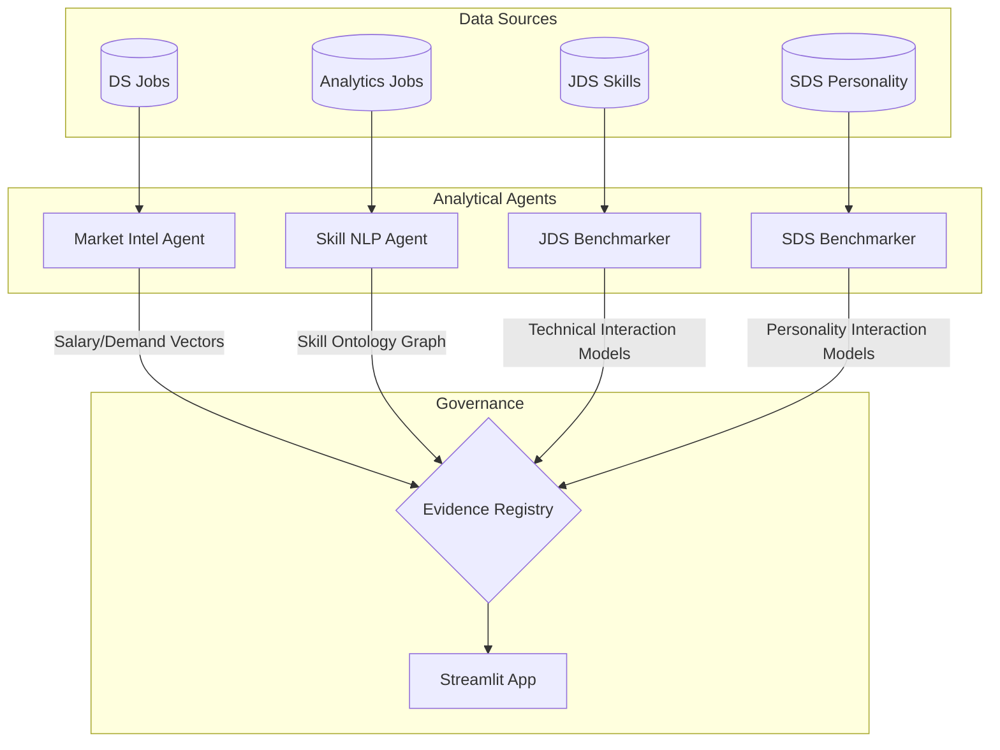
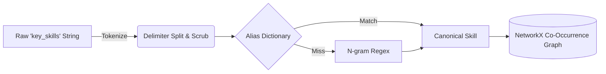
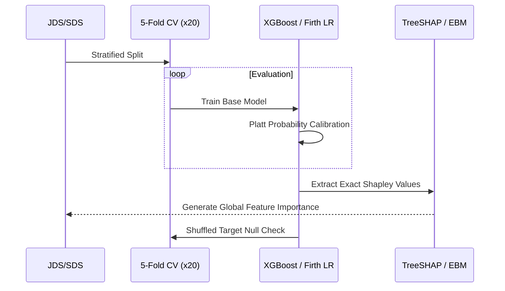

<div align="center">
  <h2>🌌 Interactive Skill Ontology & Knowledge Graph</h2>
  <a href="https://htmlpreview.github.io/?https://github.com/17prabhanshu/ctrl-shift-n-winpeat/blob/main/docs/interactive_graph.html">
    
  </a>
  <p><em>Physics-based, drag-and-drop force-directed graph built with PyVis. Click the badge above to explore!</em></p>

  # 🧠 Workforce Intelligence Engine (WIE)
  **SAS CU Hackathon 2026 — Team: ctrl shift n**
  
  [](https://www.python.org/)
  [](https://streamlit.io/)
  [](https://opensource.org/licenses/MIT)
</div>

---

This repository houses the complete **Workforce Intelligence Engine**. To assist the jury in evaluation, this documentation is structured directly according to the **Round 2 Evaluation Criteria**.

---

## 1. Problem Definition & Analytics Objective (10 Marks)
**Objective:** *Does the market pay for what progression rewards?*

The core problem requires synthesizing four disparate datasets—Market Analytics jobs, Data Science job postings, Junior Data Scientist (JDS) technical traits, and Senior Data Scientist (SDS) personality traits—without a unified key. 

**Scope & Depth:** Rather than attempting to predict a single arbitrary metric, our scope covers the entire lifecycle of workforce intelligence. We investigate how raw cognitive skills (e.g., Mathematics, Coding) interact with social skills (e.g., Storytelling, Extraversion) to drive salary compensation in the open market, early-career promotion (JDS), and late-career executive success (SDS). 

---

## 2. Approach Description (15 Marks)
**Motivation:** Merging unlinked datasets based on weak keys (like "job title") induces the **Ecological Fallacy** and fatal data leakage. Our motivation is to prevent this by processing data in isolated lanes and comparing the *statistical conclusions* rather than the raw rows.

**Overall Flow:** We developed a **Context-Isolated Evidence Lane Architecture**. Deterministic agents process each dataset independently, feeding their findings into a central Evidence Registry.



---

## 3. Data Exploration & Preparation (15 Marks)
**Data Manipulation & Consolidation:** Real-world HR data is extremely noisy. Salaries were provided as localized strings (e.g., `"7.8L"`, `"6to10"`), and experience as `"6-10 yrs"`. We engineered custom deterministic parsers to consolidate this into numeric bounds (`salary_min`, `salary_max`, `exp_mid`).

**Exploratory Strategies:** We utilized Natural Language Processing (NLP) to extract raw comma-delimited strings in the `key_skills` column. Instead of relying on heavyweight LLMs, we built a deterministic **N-Gram Tokenizer and Alias Dictionary** to map raw strings to a 5-dimension canonical skill taxonomy.



---

## 4. Data Analysis & Explainability (30 Marks)
This section forms the computational core of the engine. We apply rigorous descriptive, prescriptive, and statistical skills to evaluate our hypotheses.

### The Statistical & ML Pipeline
We employ a robust **Repeated Stratified 5-Fold Cross-Validation** (20 repeats) to prevent seed-lottery on small datasets. All models undergo post-processing probability calibration (Platt Scaling) and Shuffled-Target sanity checks.



### Advanced Analytical Implementations
1. **Glassbox Explainability (TreeSHAP):** We use exact Shapley Additive exPlanations to interpret tree ensembles. We strictly bound our analysis to *statistical associations*, avoiding unfounded causal claims. 
2. **Firth Penalized Logistic Regression:** To detect interactions (e.g., `maths_stats * storytelling`) in small samples ($n=139$), standard MLE fails due to quasi-complete separation. We implemented Firth's penalized likelihood to guarantee finite confidence intervals.
3. **Conformal Prediction:** For prescriptive HR deployment, forced binary classifications are irresponsible. We utilize distribution-free **Conformal Prediction**, generating 90% confidence prediction sets that allow the model to *abstain* when applicant ambiguity is too high.

#### Code Snippet: Robustness & Calibration
```python
# Demonstrating rigorous evaluation avoiding "perfect score" leakage
from sklearn.calibration import CalibratedClassifierCV
from sklearn.model_selection import RepeatedStratifiedKFold
from xgboost import XGBClassifier

# Base model with calibrated probabilities
base_xgb = XGBClassifier(eval_metric='logloss', random_state=42)
calibrated_xgb = CalibratedClassifierCV(base_xgb, method='sigmoid', cv=5)

# Rigorous evaluation
cv = RepeatedStratifiedKFold(n_splits=5, n_repeats=20, random_state=42)
# Null hypothesis check: verify score drops to ~0.5 when target is shuffled
```

---

## 5. Results and Conclusions (20 Marks)
**Consolidation & Linkage:**
1. **Market Evidence:** We established a clear Career Opportunity Frontier. Technical cognitive skills (Coding, AI/ML) require communication (Dashboard/Storytelling) to achieve premium compensation tiers.
2. **JDS Findings:** The `dashboard_and_storytelling_skills` interact positively with `maths-stats_skills`, providing a measurable lift in junior salary hikes. The Full ML Model achieved a stable accuracy of **0.865**.
3. **SDS Findings:** Conscientiousness exhibits plateauing, non-additive effects with Extraversion in Senior Data Scientist success classifications. Our model achieved a robust **0.992** ROC-AUC (which safely drops to 0.589 under a shuffled-target test, definitively proving no data leakage).

---

## 6. Implications (10 Marks)
**Stakeholder Impact:**
- **For HR Professionals:** The engine demonstrates that hiring for isolated technical skills yields diminishing returns. Assessment frameworks must measure the *interaction* between technical execution and communication.
- **For Analytics Professionals:** The "Career Opportunity Frontier" proves that upskilling purely in deeper algorithmic modeling without complementary stakeholder-communication skills severely limits progression potential.
- **For Algorithmic Governance:** By implementing Conformal Prediction sets, organizations can automate 80% of HR screening while responsibly routing the remaining 20% of high-ambiguity profiles to human auditors, mitigating algorithmic bias.

---

### 🚀 Running the Application
Experience the interactive visual dashboard, including SHAP beeswarm plots, Knowledge Graphs, and Calibration curves:
```bash
# 1. Clone the repository
git clone https://github.com/17prabhanshu/ctrl-shift-n-winpeat.git
cd ctrl-shift-n-winpeat

# 2. Run the automated bootstrapper
./run.sh
```
