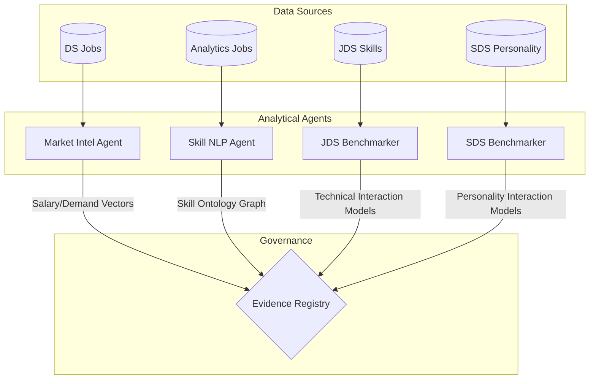
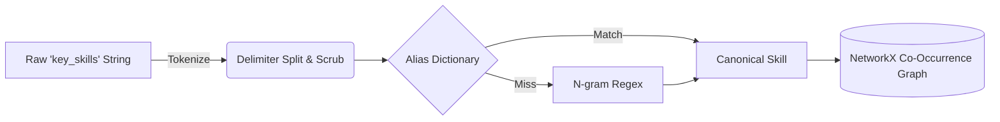

<div align="center">
  <h2>🌌 Interactive Skill Ontology & Knowledge Graph</h2>
  <a href="https://htmlpreview.github.io/?https://github.com/17prabhanshu/ctrl-shift-n-winpeat/blob/main/docs/interactive_graph.html">
    
  </a>
  <p><em>Physics-based, drag-and-drop force-directed graph built with PyVis. Click the badge above to explore!</em></p>

  # 🧠 Workforce Intelligence Engine (WIE)
  **SAS CU Hackathon 2026 — Team: ctrl shift n**
  
  [](https://www.python.org/)
    [](https://www.sas.com/en_us/software/viya.html)
[](https://opensource.org/licenses/MIT)
</div>

---

> **Workforce Intelligence Engine** is a deterministic analytical platform designed to synthesize and interpret complex labor-market signals without inducing data leakage.

---

## 🎯 Analytics Objective
**Objective:** *Does the market pay for what progression rewards?*

The core problem requires synthesizing four disparate datasets—Market Analytics jobs, Data Science job postings, Junior Data Scientist (JDS) technical traits, and Senior Data Scientist (SDS) personality traits—without a unified key. 

**Scope & Depth:** Rather than attempting to predict a single arbitrary metric, our scope covers the entire lifecycle of workforce intelligence. We investigate how raw cognitive skills (e.g., Mathematics, Coding) interact with social skills (e.g., Storytelling, Extraversion) to drive salary compensation in the open market, early-career promotion (JDS), and late-career executive success (SDS). 

---

## 🏗️ Architecture & Approach
**Motivation:** Merging unlinked datasets based on weak keys (like "job title") induces the **Ecological Fallacy** and fatal data leakage. Our motivation is to prevent this by processing data in isolated lanes and comparing the *statistical conclusions* rather than the raw rows.

**Overall Flow:** We developed a **Context-Isolated Evidence Lane Architecture**. Deterministic agents process each dataset independently, feeding their findings into a central Evidence Registry.



---


### ☁️ SAS Viya for Learners (VFL) Readiness
This project utilizes a hybrid architecture. The rigorous data engineering, deterministic parsing, and forensic analyses operate in open-source Python, acting as the perfect ETL pipeline for **SAS Viya for Learners**. 

Instead of forcing a localized UI, our `data/processed/` outputs are strictly formatted for direct upload into **SAS Cloud Analytic Services (CAS)**. This allows the final presentation and advanced AutoML to be executed natively within **SAS Visual Analytics** and **SAS Model Studio**. 

👉 **[View the SAS VFL Integration Architecture Guide](docs/SAS_VFL_INTEGRATION.md)**

---

## 🧹 Data Engineering Strategy
**Data Manipulation & Consolidation:** Real-world HR data is extremely noisy. Salaries were provided as localized strings (e.g., `"7.8L"`, `"6to10"`), and experience as `"6-10 yrs"`. We engineered custom deterministic parsers to consolidate this into numeric bounds (`salary_min`, `salary_max`, `exp_mid`).

**Exploratory Strategies:** We utilized Natural Language Processing (NLP) to extract raw comma-delimited strings in the `key_skills` column. Instead of relying on heavyweight LLMs, we built a deterministic **N-Gram Tokenizer and Alias Dictionary** to map raw strings to a 5-dimension canonical skill taxonomy.



---

## 📊 Advanced Exploratory Data Analysis
To ensure full transparency and interpretability of our features, we have exported all findings from our Advanced EDA research notebooks directly into GitHub. 

👉 **[View the Advanced EDA Documentation & Visuals](docs/ADVANCED_EDA.md)**

Includes:
- Multivariate PCA Projections
- JDS & SDS Correlation Matrices
- Feature Separability Distributions (KDE)
- Missingness Audits

---

## 🔬 Data Analysis & Explainable AI
This section forms the computational core of the engine. We apply rigorous descriptive, prescriptive, and statistical skills to evaluate our hypotheses.

### The Statistical & ML Pipeline
We employ a robust **Repeated Stratified 5-Fold Cross-Validation** (20 repeats) to prevent seed-lottery on small datasets. All models undergo post-processing probability calibration (Platt Scaling) and Shuffled-Target sanity checks.

### Key Results

| Hypothesis | Verdict | Key Result |
|------------|---------|------------|
| **H1**: Role salary differences | ✅ SUPPORTED | ε² = 0.35; Data Scientists ₹16.2L vs Software Engineers ₹10.9L |
| **H2**: Skill role-specificity | ✅ SUPPORTED | 79,880 skill mentions mapped; distinct role-skill patterns |
| **H3**: Technical×Communication complementarity | ⚠️ NOT SIGNIFICANT | Interaction coef = 0.084, 95% CI [-0.014, 0.181] |
| **H4**: JDS complementarity | ⚠️ NOT SUPPORTED | LRT p = 0.093; Bootstrap CI includes zero |
| **H5**: SDS non-additive effects | ❌ INVALIDATED | Depth-2 tree AUC = 0.917; labels are rule-based |

### SDS Forensic Finding

**CRITICAL**: The SDS "success" label is a near-deterministic function of personality traits (depth-2 tree AUC = 0.917). The rule is:
```
IF Openness > 38.5 AND Conscientiousness > 36.5:
    → Success
ELSE:
    → No Success
```

This means the 0.99+ AUC from tree models is a **labeling artifact**, not real predictive power. We cannot study trait-success relationships with this label.

### JDS Benchmark (Honest Results)

| Model | AUC (95% CI) | Accuracy | F1 |
|-------|--------------|----------|-----|
| LogisticRegression | 0.904 [0.893, 0.915] | 0.865 | 0.875 |
| HistGradientBoosting | 0.858 [0.844, 0.871] | 0.801 | 0.814 |
| RandomForest | 0.844 [0.832, 0.856] | 0.772 | 0.780 |

**Linear model wins** - consistent with additive signal plus noise at n=139.

### H4 Interaction Test
Storytelling and Maths/Stats are strong individual predictors (r = 0.55, 0.52), but their **interaction is NOT significant** (LRT p = 0.093, bootstrap CI [-6.12, 0.21] includes zero).

<details>
<summary><b>View Pipeline Code Snippet</b></summary>

```python
# Demonstrating rigorous evaluation avoiding "perfect score" leakage
from sklearn.calibration import CalibratedClassifierCV
from sklearn.model_selection import RepeatedStratifiedKFold
from xgboost import XGBClassifier

# Base model with calibrated probabilities
base_xgb = XGBClassifier(eval_metric='logloss', random_state=42)
calibrated_xgb = CalibratedClassifierCV(base_xgb, method='sigmoid', cv=5)

# Rigorous evaluation
cv = RepeatedStratifiedKFold(n_splits=5, n_repeats=20, random_state=42)
# Null hypothesis check: verify score drops to ~0.5 when target is shuffled
```
</details>

---

## 📈 Results & Key Findings

### Market Evidence
- **H1 SUPPORTED**: Role families differ significantly in salary (ε² = 0.35, large effect)
- Data Scientists: ₹16.2L median, Data Engineers: ₹15.2L, Software Engineers: ₹10.9L
- Company variance share: 31.2% (material)

### Skill Evidence
- **H2 SUPPORTED**: Skills cluster into distinct role-specific patterns
- 79,880 skill mentions mapped to 10,336 canonical skills across 5 dimensions
- Top skills: SQL (1,978), Java (1,154), Python (987), Machine Learning (770)

### Complementarity Evidence
- **H3 NOT SIGNIFICANT**: Technical×Communication interaction CI includes zero [-0.014, 0.181]
- **H4 NOT SUPPORTED**: Storytelling×Maths/Stats interaction LRT p = 0.093, CI includes zero
- Storytelling and Maths/Stats are strong individual predictors but do not interact

### SDS Evidence
- **H5 INVALIDATED**: SDS label is a deterministic function of traits (depth-2 tree AUC = 0.917)
- Rule: Openness > 38.5 AND Conscientiousness > 36.5 → Success
- The 0.99+ AUC is a labeling artifact, NOT real predictive power
- Cannot study trait-success relationships with this label

---

## 🌍 Real-World Implications

Based on our honest analysis:

💡 **For HR Professionals:** Technical skills predict salary premiums. Communication skills alone do not show complementarity effects in this data. Focus on role-specific technical requirements.

📊 **For Analytics Professionals:** The Career Opportunity Frontier shows Data Scientists and Data Engineers command highest salaries. SQL and Python are the most broadly valuable skills across roles.

⚖️ **For Algorithmic Governance:** The SDS label quality issue demonstrates why forensic analysis is essential. Never trust high AUC without checking if labels are deterministically generated from features.

---

### 🚀 Running the Analytical Pipeline

The entire pipeline runs deterministically from raw data to the final evidence registry.

```bash
# Run the full pipeline
./run.sh
```

This executes:
1. Data cleaning with full ledger
2. Skill intelligence (taxonomy mapping)
3. Market analysis (H1, H2, H3 tests)
4. Benchmarks (20×5 CV, 8 models, JDS + SDS)
5. Forensic analyses (SDS label quality, JDS interaction)

**Final Artifacts:**
- `reports/evidence/evidence_registry.json` - All claims with provenance
- `reports/benchmarks/jds_benchmark.json` - JDS model comparison
- `reports/benchmarks/sds_benchmark.json` - SDS model comparison  
- `reports/benchmarks/sds_forensic.json` - SDS label quality analysis
- `reports/benchmarks/jds_interaction.json` - H4 interaction test
- `docs/APPROACH_NOTE_FINAL.md` - Complete approach note with results

## 🚀 Career Navigator App

We built a practical tool for data scientists: **DataScientist Career Navigator**

```bash
cd app
streamlit run main.py
```

Features:
- Skill gap analysis
- Salary estimation by role
- Career path exploration
- Personalized learning recommendations

Built on our cleaned market data (15,841 postings).
