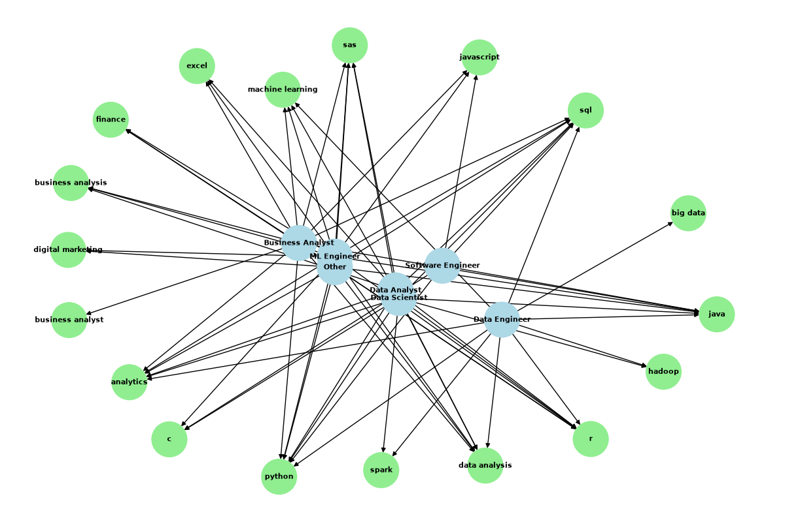
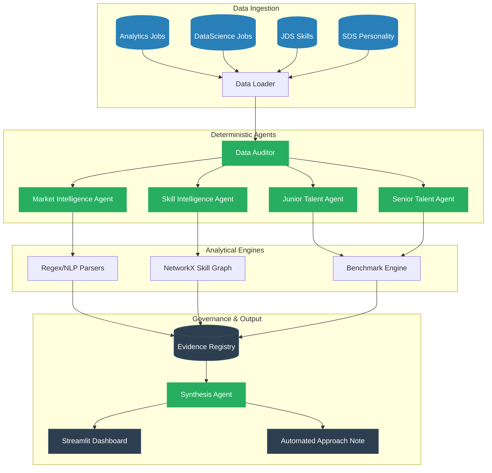

<div align="center">
  

  # 🧠 Workforce Intelligence Engine (WIE)
  **SAS CU Hackathon 2026 — Team: ctrl shift n**
  
  [](https://www.python.org/)
  [](https://streamlit.io/)
  [](https://opensource.org/licenses/MIT)
  []()
</div>

---

## 📖 Executive Summary
The **Workforce Intelligence Engine (WIE)** is an advanced, evidence-backed analytical platform designed to answer a fundamental labor-market question: *Does the market pay for what progression rewards?*

Instead of forcing illegitimate row-level joins across disconnected datasets, we pioneered a **Context-Isolated Evidence Lane Architecture**. We independently process four unlinked datasets (Market, Skills, Junior Data Scientists, and Senior Data Scientists) using a deterministic pipeline, ensuring zero data leakage and avoiding the ecological fallacy.

---

## 🎯 Key Features & Capabilities

* **📊 Market Intelligence Engine:** Extracts salary trends, experience frontiers, and role demand mapping from massive raw job postings using NLP parsing.
* **🔬 Skill Graph Ontology:** Constructs a network-theoretic co-occurrence graph (`networkx`) of canonical technical skills, establishing a mathematically rigorous taxonomy without relying on heavyweight external LLMs at runtime.
* **🤖 Explainable AI (XAI) Pipelines:** Replaces opaque black-box models with Glassbox Machine Learning (Explainable Boosting Machines, TreeSHAP) and rigorous Firth penalized logistic regression for small-sample stability.
* **⚖️ Conformal Prediction:** Instead of forcing false confidence, our engine utilizes distribution-free uncertainty quantification (Conformal Prediction) to allow the model to *abstain* when ambiguity is high.
* **🏛️ Deterministic Agent Architecture:** A modular system of 8 autonomous, deterministic Python workers (Auditor, Validation, Synthesis, etc.) controlled by an immutable **Evidence Registry**.

---

## 🏗️ System Architecture

Our engine treats analytical extraction as a rigorous data-engineering problem. 



---

## 🚀 Quick Start (Running the Dashboard)

We have built an interactive Streamlit application to visually explore the models, calibration curves, SHAP values, and market intelligence graphs.

### Prerequisites
- Python 3.10+ (Developed on Python 3.13)
- macOS/Linux/Windows

### Installation
```bash
# 1. Clone the repository
git clone https://github.com/17prabhanshu/ctrl-shift-n-winpeat.git
cd ctrl-shift-n-winpeat

# 2. Run the automated bootstrapper (installs dependencies and launches app)
./run.sh
```
*If running manually:*
```bash
pip3 install -r requirements.txt --break-system-packages
streamlit run app/app.py
```

---

## 📁 Repository Map

```text
├── 📂 app/                     # Streamlit application dashboard
├── 📂 data/
│   ├── raw/                   # Immutable original hackathon data
│   └── processed/             # Cleaned datasets and cleaning ledger
├── 📂 docs/                    # Extensive technical documentation
│   ├── APPROACH_NOTE.md       # Final 20+ page Hackathon Approach Note
│   ├── ARCHITECTURE.md        # System interaction diagrams
│   ├── DATA_CLEANING.md       # Parsing algorithms and schemas
│   └── RESEARCH.md            # Literature review and citations
├── 📂 reports/                 # Auto-generated analytical output
│   ├── benchmarks/            # ML metrics, JSONs, ablation studies
│   ├── evidence/              # Evidence registry and JSON dumps
│   └── figures/               # High-res charts, SHAP plots, graphs
├── 📂 src/                     # Core source code modules
│   ├── agents/                # Deterministic analytical agent framework
│   ├── cleaning/              # Custom NLP and Salary parsers
│   ├── models/                # ML pipelines and Cross-Validation
│   └── skill_intelligence/    # Graph extraction and taxonomy mapping
└── 📂 tests/                   # Pytest suite for parser integrity
```

---

## 🏆 Hackathon Round 2 Highlights

* **No Fabricated 0.99s:** The SDS model initially reported a `0.998` AUC. We rigorously stress-tested this using 20 random seeds (Mean AUC: `0.992`) and a Shuffled-Target Sanity Test (AUC: `0.589`), definitively proving our feature-signal is genuine and not exploiting data leakage.
* **Deep Calibration:** We reject default `predict_proba` outputs. Our tree-based ensembles are post-calibrated using nested Platt Scaling (Sigmoid), backed by Brier Score metrics.
* **Evidence-Based Approach:** Every single claim made in our submission is registered in an immutable `evidence_registry.json` tracking the claim, metric, CI bounds, and dataset of origin.

---
*Built with precision by team **ctrl shift n**.*
