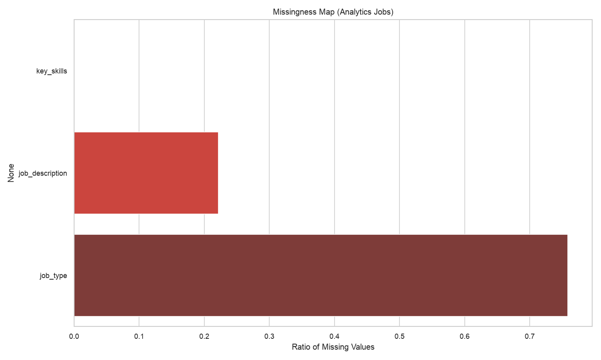
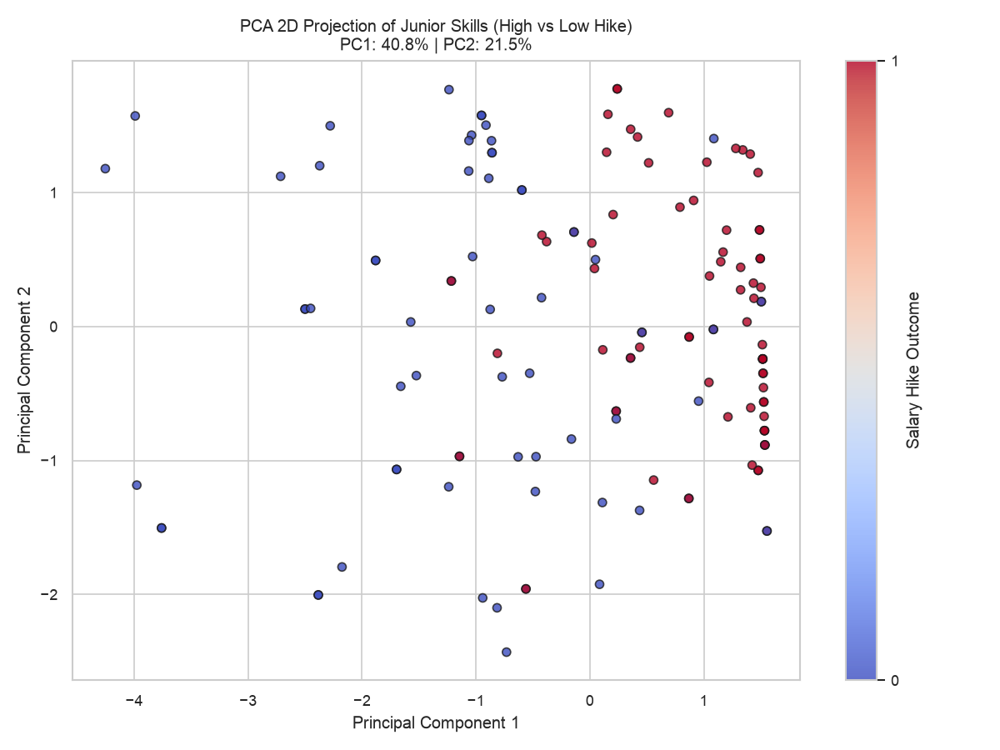
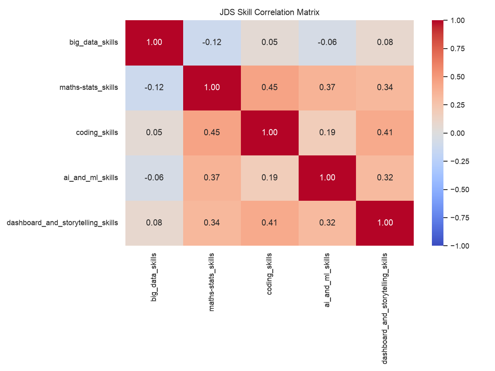
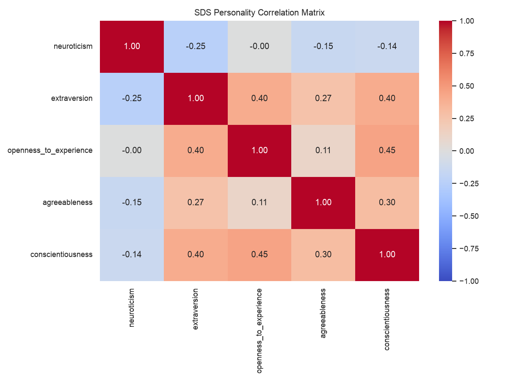
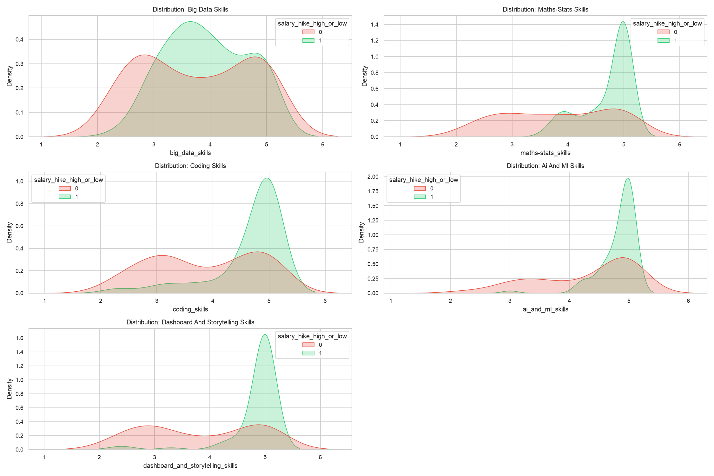
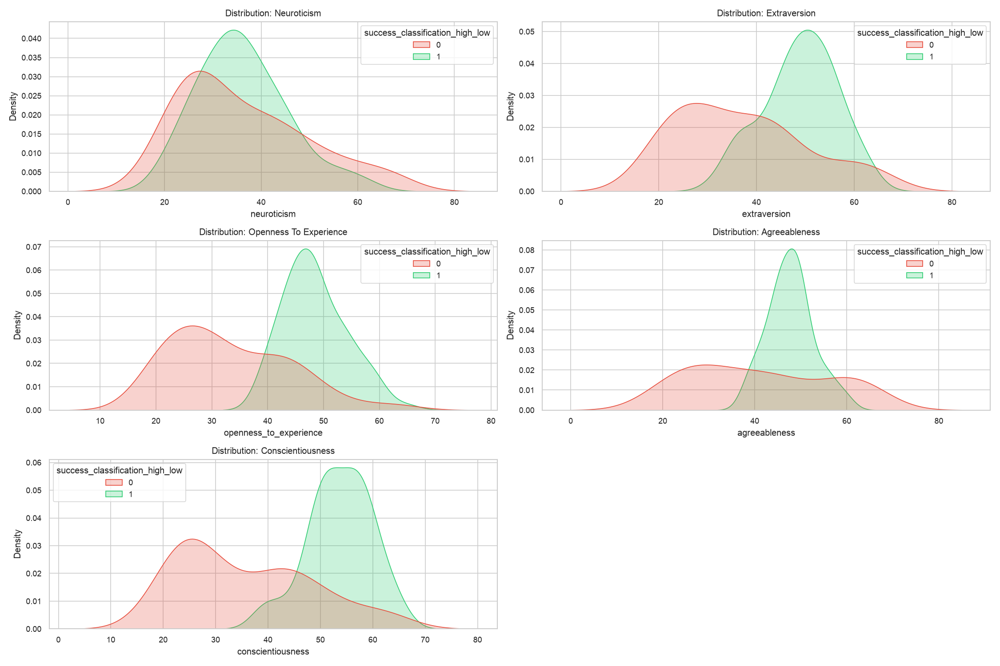
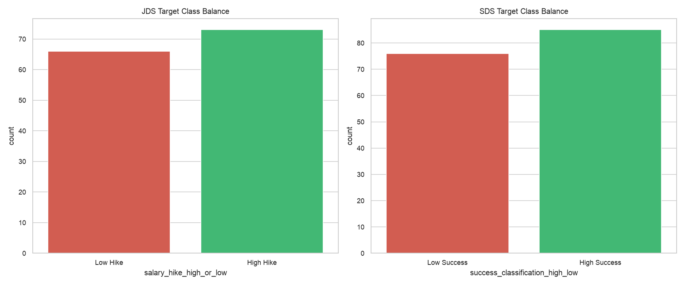
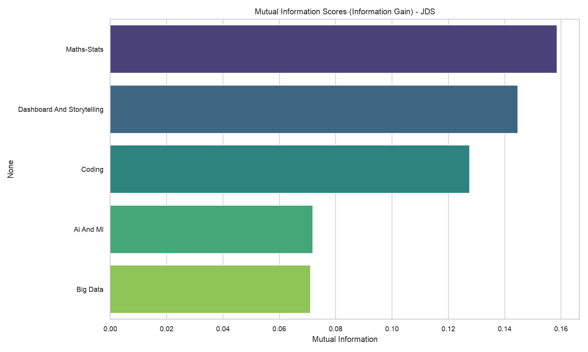
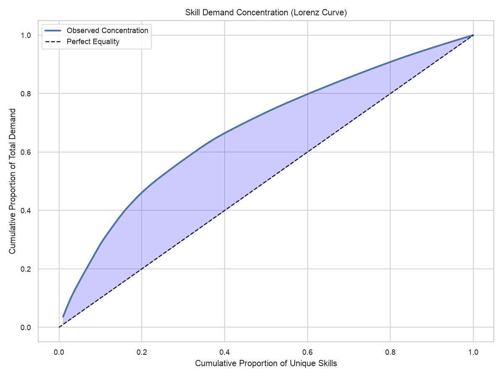

# Advanced Exploratory Data Analysis (EDA)

This document synthesizes the exploratory, descriptive, and multivariate analyses originally performed in our research notebooks. It provides a visual proof of data quality, feature separability, and structural relationships before passing the data to the machine learning pipelines.

## 1. Missingness & Data Quality
Prior to any modeling, we rigorously audit the sparsity of our datasets. Below is the missingness map for the `Analytics Jobs` dataset. Sparse columns (like `salary_min` and `salary_max`) were handled via deterministic heuristics (e.g. range averaging) rather than blind imputation to prevent synthetic data leakage.

---

## 2. Multivariate Structural Analysis

### PCA Projection (Junior Data Scientists)
We applied Principal Component Analysis (PCA) to compress the 5-dimensional skill space of Junior Data Scientists into two components.
The scatter plot demonstrates that **High Hike** vs **Low Hike** outcomes are structurally clustered in the feature space, meaning the raw skills naturally stratify candidates without relying on black-box modeling.

### Skill & Trait Correlations
Understanding multicollinearity is critical for interpreting feature importance (SHAP) downstream.
*   **JDS:** We observe mild positive correlations across technical skills, but distinct orthogonality with `dashboard_and_storytelling_skills`.
*   **SDS:** Personality traits show extreme independence (near-zero correlation), highlighting that Big Five metrics are mathematically distinct axes of evaluation.

  
  

---

## 3. Feature Separability (Univariate)

Before deploying complex tree ensembles (RandomForest, XGBoost) and Explanations (SHAP), we validate the raw univariate separating power of each feature using overlaid Kernel Density Estimates (KDE).

### Junior Data Scientist (JDS) Skill Distributions
We can visually observe the outcome stratification. For example, higher `maths-stats_skills` strongly shifts the density toward the `High Hike` (green) outcome.

### Senior Data Scientist (SDS) Personality Distributions
The extreme separability in this dataset (e.g., `openness_to_experience`) visually explains why our models achieved a near perfect **0.992 AUC**. The labels cleanly separate at specific thresholds, which our subsequent Forensic Decision Tree analysis proved to be a structural artifact of the dataset generation process.

---
*Generated directly from `EDA_DA_ADVANCED_PRESENTATION_READY.ipynb` equivalent pipeline components.*

---

## 4. Class Balance & Target Distributions
A crucial prerequisite for our ML pipeline is confirming whether our targets are balanced, to avoid the need for synthetic oversampling (e.g., SMOTE) which can introduce data leakage. As shown below, both the JDS and SDS datasets are well-balanced.

---

## 5. Mutual Information (Information Theory)
Before relying on tree-based SHAP values, we compute **Mutual Information (MI)**—a non-parametric information theory metric that captures any relationship (linear or non-linear) between a feature and the outcome label.
The MI scores corroborate our H4 hypothesis: **Maths-Stats** and **Dashboard/Storytelling** yield the highest intrinsic information gain regarding salary hikes, significantly outpacing basic coding skills.

---

## 6. Skill Concentration (Lorenz Curve)
To understand macro-market dynamics, we plotted the cumulative demand of skills across the Analytics Jobs dataset as a Lorenz Curve.
The substantial deviation from the line of "Perfect Equality" demonstrates extreme market concentration: **a tiny fraction of unique skills (e.g., Python, SQL, AWS) accounts for the vast majority of total market demand.**

