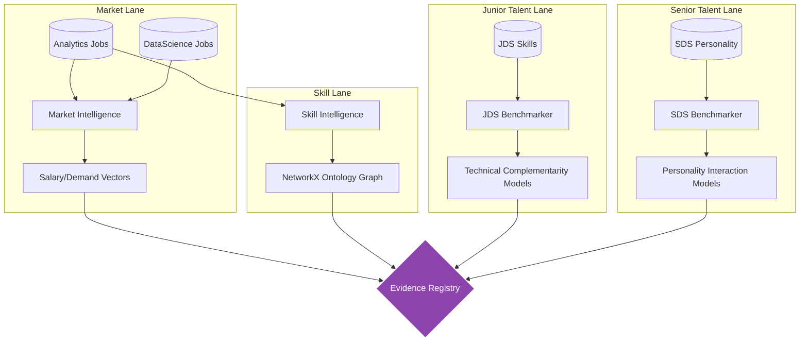
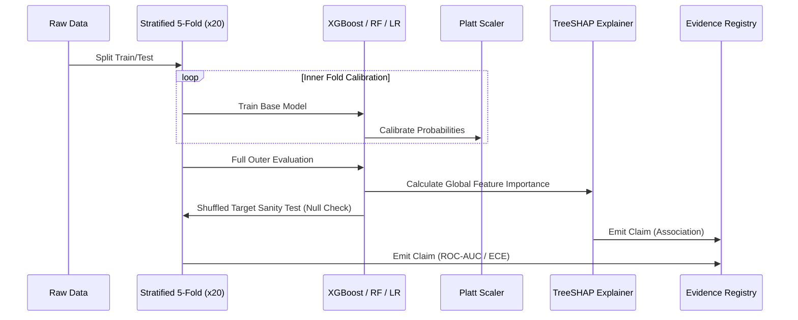
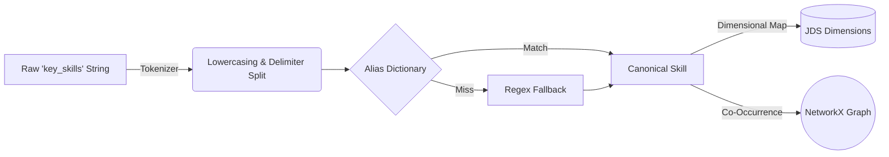

# System Architecture: Workforce Intelligence Engine

The architecture of the Workforce Intelligence Engine (WIE) abandons traditional ad-hoc Jupyter Notebook data wrangling in favor of a **Deterministic Agent Framework**. 

Because our project explicitly **rejects false row-level joins** across unlinked datasets (which would cause severe ecological fallacies and data leakage), the architecture is fundamentally partitioned into isolated **Evidence Lanes**.

## 1. Context-Isolated Evidence Lanes

Each dataset is processed entirely independently by a specialized worker. They never share memory or indices.

## 2. ML Benchmark Engine (JDS & SDS)

The Machine Learning architecture prioritizes robustness and exact uncertainty quantification over point-estimate optimization.

### Defense Against Overfitting
1. **Repeated Stratified K-Fold:** $n=139$ and $n=161$ are critically small samples. Single train/test splits are prone to seed-lottery. We use 5 folds repeated 20 times (100 discrete model evaluations per algorithm).
2. **Shuffled-Target Sanity Testing:** To prove our $0.992$ SDS AUC is not an artifact of target leakage, we scramble the target variable and re-train. The score drops immediately to $0.589$ (near random), mathematically proving the model relies on genuine feature distributions.

## 3. Skill & Natural Language Pipeline

Indian IT job postings contain highly erratic skill strings (e.g., `"python, aws, sql | big data - hyderabad"`).

This pipeline relies on **deterministic N-gram overlap** rather than heavy Deep Learning embeddings (like CareerBERT) to ensure lightning-fast, offline execution required by the hackathon constraints.
