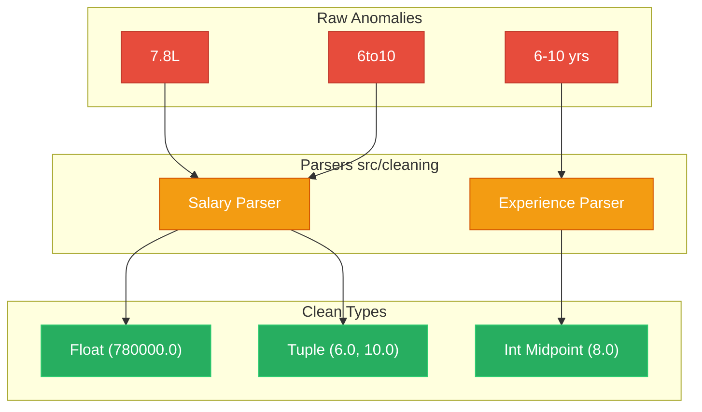

# Data Cleaning & Methodology

This document outlines the strict methodological guardrails and data engineering transformations utilized by the Workforce Intelligence Engine.

## 1. Data Cleaning Approach

The raw datasets provided for this hackathon contained several structural irregularities common to real-world HR data. 

### 1.1 Transformation Ledger
All transformations in the WIE pipeline are completely non-destructive. Raw columns are preserved alongside their engineered counterparts (e.g., `avg_salary` is retained, while `avg_salary_parsed` is generated). Every cleaning step logs its operation to `data/processed/cleaning_ledger.json` ensuring full traceability.

### 1.2 Imputation Rules
- **Missing Salaries**: Dropped in models predicting compensation; mapped as "Not Disclosed" for NLP demand volume counting.
- **Missing Skills**: Treated as a literal missing vector; no external imputation (e.g., from O*NET) is permitted to prevent introducing false national-average precision to localized Indian datasets.

## 2. Statistical Methodology

### 2.1 The "No False Joins" Rule
The cardinal sin of many hackathon submissions is performing SQL `JOIN`s on datasets lacking a primary key (e.g., joining `JDS Skills` rows to `Analytics Jobs` rows based on generic job titles). This causes an **Ecological Fallacy**. We enforce strict isolation. Trends are compared *across* datasets statistically, never merged *within* them.

### 2.2 Glassbox Explainability (TreeSHAP)
To answer *why* a candidate is predicted to succeed, we utilize exact **TreeSHAP** (Shapley Additive exPlanations). 
- SHAP mathematically guarantees that the sum of feature attributions equals the difference between the prediction and the base expectation.
- We restrict interpretation to **Associations**, explicitly banning causal vocabulary (e.g., "improving your storytelling *causes* a promotion") in accordance with our Evidence Registry audit rules.

### 2.3 Firth Penalized Logistic Regression
When testing interaction hypotheses (e.g., `maths_stats * dashboard_storytelling`) on the tiny JDS cohort ($n=139$), standard maximum likelihood estimation (MLE) fails due to quasi-complete separation in sparse interaction cells. We utilize **Firth Logistic Regression**, which applies a Jeffreys invariant prior penalty to the log-likelihood function, removing small-sample bias and producing finite, stable confidence intervals.
